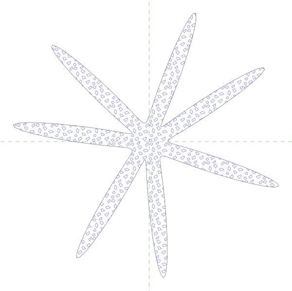

# dashing - a library for autocad-style hatch patterns

License: permissive (zlib); see source files for additional details.

On a i5-1235U in multithreaded benchmark mode, it runs at over 3.3 billion dashes per second:
```
$ time ./dashing.omp -b -s .002 data/HWOOD6E1.pat  data/sf.seg
2822685873
real	0m0.851s
```



# Development status

The author (@jepler) is not actively using or developing this project.
Issues and pull requests are not likely to be acted on.
I would be interested in passing this project to a new maintainer.

# Usage
## API

`xyhatch(const HatchPattern&, It start, It end, Cb cb, Wr wr)`:
    Iterators `start`..`end` define a range of segments, which must define a set of closed contours.
    The winding rule `wr` defines which regions are in the interior of the contours.
    For each dash or dot in the resulting hatch, `cb` is called with the output segment.

`xyhatch(const HatchPattern&, const C &segments, Cb cb, Wr wr)`:
    The container C holds segments which must define a set of closed
    contours.
    The winding rule `wr` defines which regions are in the interior of the contours.
    For each dash or dot in the resulting hatch, `cb` is called with the output segment.

`xyhatch(const HatchPattern&, const C &segments, Cb cb, const char *wr)`:
    The container C holds segments which must define a set of closed
    contours.
    The winding rule `wr` defines which regions are in the interior of the contours.
    For each dash or dot in the resulting hatch, `cb` is called with the output segment.

`HatchPattern::FromFile`: Read a hatch pattern from a file.

`parse_numbers(std::string line)`: Read a comma and/or space-separated
    sequence of numbers into a vector

`SegmentsFromFile`, `ContoursFromFile`, `ContourToSegments`, `ContoursToSegments`: Read and convert segments and contours

Useful winding rules include:
 * `[](int i) { return i % 2 != 0; }`, the even-odd winding rule
 * `[](int i) { return i != 0;}`, the non-zero winding rule
 * `[](int i) { return i > 0;}`, the greater-than-zero winding rule
 
but any predicate of a single integer may be used.

### Parallel API
These APIs are available if built with `-fopenmp -DDASHING_OMP`

`xyhatch_omp(const HatchPattern&, It start, It end, Cb cb, Wr wr)`:
    Iterators `start`..`end` define a range of segments, which must define a set of closed contours.
    The winding rule `wr` defines which regions are in the interior of the contours.
    For each dash or dot in the resulting hatch, `cb` is called with the output segment and the thread ID.

`xyhatch_omp(const HatchPattern&, const C &segments, Cb cb, Wr wr)`:
    The container C holds segments which must define a set of closed
    contours.
    The winding rule `wr` defines which regions are in the interior of the contours.
    For each dash or dot in the resulting hatch, `cb` is called with the output segment and the thread ID.

### Other APIs

Other items in the header files are implementation details.

## Demo program

The demo program, which compiles to `dashing` with `make`, reads a dash
pattern file and a segment list file and produces a svg file on the output
which visualizes the result of the hatch operation.

A segment list file consists of a closed contour on each line specified as a series of x,y coordinates.  For instance, this segment list is a simple box:
```
-100 -100 100 -100 100 100 -100 100
```
The first point is `-100 -100`.

It accepts several commandline parameters:

    -b: Benchmark mode: print only the number of dashes that would have been
        generated

    -j: Apply a jitter to all coordinates in the segment list file

    -s: scale the dash pattern file by a given factor
    
    -r rulename: select the given rulename, one of the following: odd nonzero positive negative abs_geq_two
